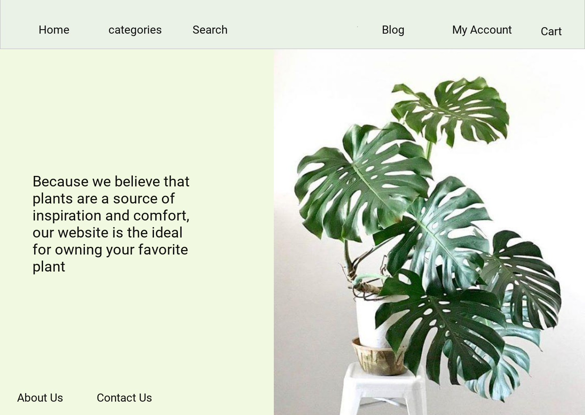

# Kappa project

## Nabtah :
We will start from name , it is Arabic word means anything grown out of the ground , so our project is online store  to selling plants, flowers and some things related on plants.  
we also have a blog to make a communication between our users to share  our products .

<b>Wireframe:</b>

<b>Used technologies:</b>

<ul>
  <li>HTML</li>
   <li>CSS</li>
   <li>Javascript</li>
   <li>Node js</li>
   <li> Express</li>
  <li> Mongoose</li>
  <li> bootstrap </li>
  </ul>

<b>Some of screenshots from website:</b>

The home page shows all the products added by the merchant

You can view by category using the drop-down lists on the page header

If you want more details about a product easily click on its picture
or type the name in the search bar

Join us in Nabtah Friends, where you can add pictures of your plants and tell us what is new and how you are taking care of them.

You can read more about Nabtah and always contact us through the following links

 sessions are used to log out

 sessions are used to make only logged in user can add to cart

sessions are used to make only logged in user can post to our blog

<b> link to the website: https://nabtah-1.herokuapp.com/ </b> 
